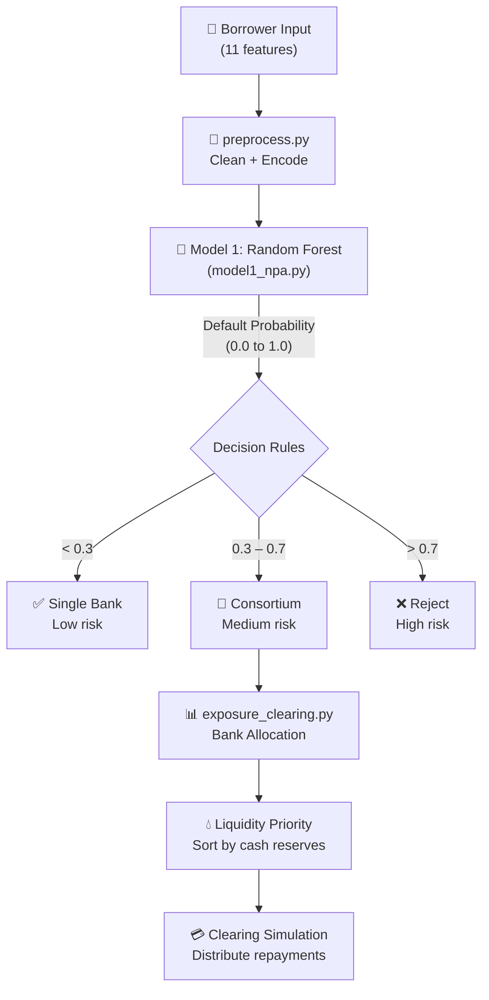

# 🏦 AI-Based Loan Default Prediction — Full Project Explanation

## 1. What Is This Project?

This is an **AI-driven banking decision support system** built with **Python + Streamlit** that solves a critical real-world problem in banking: **should a bank approve a loan, and if so, how should the risk be managed?**

It goes far beyond a simple "approve/reject" model. The system simulates a **complete banking workflow**:

```
Borrower applies → AI predicts risk → Decision is made → Loan is distributed → Repayment is tracked
```

> [!IMPORTANT]
> **Aligned with UN Sustainable Development Goals:**
> - **SDG 8** – Decent Work and Economic Growth (smarter lending = healthier economy)
> - **SDG 9** – Industry, Innovation and Infrastructure (AI-powered banking infrastructure)

---

## 2. The Real-World Problem

In India (and globally), banks face a massive challenge with **NPAs (Non-Performing Assets)** — loans where borrowers stop paying. As of recent RBI data, Indian banks collectively hold lakhs of crores in NPAs.

### What banks currently do (the old way):
- A credit officer manually reviews your application
- They check your CIBIL score, income, employment
- They make a subjective judgment call
- If the loan is too risky for one bank, they may reject it outright

### What this project does (the AI way):
- **Model 1 (Random Forest)** calculates the exact probability of default (e.g., "this borrower has a 45.3% chance of defaulting")
- **Model 2 (Decision Tree)** decides the best strategy: single bank, consortium, or reject
- **Consortium engine** distributes the loan across multiple banks so no single bank bears all the risk
- **Clearing house** simulates how repayments flow back to each bank

---

## 3. Project Architecture



---

## 4. File-by-File Breakdown

### Source Files

| File | Purpose | Key Function |
|------|---------|-------------|
| [app.py](file:///c:/Users/tusha/OneDrive/Desktop/loan_project/app.py) | Streamlit web UI — the front-end dashboard | Entire user interaction |
| [preprocess.py](file:///c:/Users/tusha/OneDrive/Desktop/loan_project/preprocess.py) | Loads CSV, cleans data, encodes categoricals | `load_and_preprocess()` |
| [model1_npa.py](file:///c:/Users/tusha/OneDrive/Desktop/loan_project/model1_npa.py) | Trains the NPA/default prediction model | `train_model1()` |
| [model2_consortium.py](file:///c:/Users/tusha/OneDrive/Desktop/loan_project/model2_consortium.py) | Trains the consortium decision model | `train_model2()` |
| [train_models.py](file:///c:/Users/tusha/OneDrive/Desktop/loan_project/train_models.py) | Orchestrates the full training pipeline | Entry point script |
| [exposure_clearing.py](file:///c:/Users/tusha/OneDrive/Desktop/loan_project/exposure_clearing.py) | Bank allocation, liquidity sorting, clearing | `allocate_consortium()`, `simulate_clearing()` |

### Data Files

| File | Purpose |
|------|---------|
| [credit_risk_dataset.csv](file:///c:/Users/tusha/OneDrive/Desktop/loan_project/credit_risk_dataset.csv) | ~32,000 borrower records from Kaggle for training |
| [bank_dataset.csv](file:///c:/Users/tusha/OneDrive/Desktop/loan_project/bank_dataset.csv) | 10 Indian banks with financial metrics |

### Saved Models (in `models/` folder)

| File | What It Contains |
|------|-----------------|
| `model1_rf.pkl` | Trained Random Forest (NPA predictor) |
| `model2_dt.pkl` | Trained Decision Tree (consortium decider) |
| `encoders.pkl` | LabelEncoders for categorical features |

---

## 5. The 11 Input Features

These are the data points collected from every loan applicant:

| # | Feature | Type | Example | What It Tells the Bank |
|---|---------|------|---------|----------------------|
| 1 | `person_age` | Numeric | 28 | Younger borrowers may be riskier |
| 2 | `person_income` | Numeric | ₹5,00,000 | Can they afford repayments? |
| 3 | `person_home_ownership` | Categorical | RENT / OWN / MORTGAGE | Stability indicator |
| 4 | `person_emp_length` | Numeric | 5 years | Job stability |
| 5 | `loan_intent` | Categorical | EDUCATION / MEDICAL / PERSONAL | Why do they need the money? |
| 6 | `loan_grade` | Categorical | A (best) → G (worst) | Bank's internal credit rating |
| 7 | `loan_amnt` | Numeric | ₹2,00,000 | How much are they asking for? |
| 8 | `loan_int_rate` | Numeric | 12.5% | Higher rate = higher risk profile |
| 9 | `loan_percent_income` | Numeric | 0.4 (40%) | Debt-to-income burden |
| 10 | `cb_person_default_on_file` | Categorical | Y / N | Have they defaulted before? |
| 11 | `cb_person_cred_hist_length` | Numeric | 8 years | Longer history = more trustworthy |

---

## 6. The Two ML Models — Explained

### Model 1: NPA Prediction (Random Forest)

**Algorithm:** Random Forest Classifier (100 decision trees, max depth 15)

**What it does:** Takes the 11 features and outputs a **probability between 0 and 1** representing the chance that this borrower will default.

**Real-world analogy:** Think of it as 100 different credit officers, each looking at the borrower's data slightly differently. They all vote — if 73 out of 100 say "this person will default," the probability is 0.73 (73%).

**Training process** (in [model1_npa.py](file:///c:/Users/tusha/OneDrive/Desktop/loan_project/model1_npa.py#L14-L69)):
1. Split data 80/20 (train/test) with stratified sampling
2. Train on ~25,600 borrower records
3. Evaluate with accuracy + ROC-AUC score
4. Save to `model1_rf.pkl`

---

### Model 2: Consortium Decision (Decision Tree)

**Algorithm:** Decision Tree Classifier (max depth 10)

**What it does:** Takes the same 11 features and classifies the borrower into one of 3 categories:

| Class | Label | Meaning |
|-------|-------|---------|
| 0 | Single Bank | Low risk — one bank can handle it |
| 1 | Consortium | Medium risk — share it across banks |
| 2 | Reject | High risk — don't lend at all |

**How it's trained** (in [model2_consortium.py](file:///c:/Users/tusha/OneDrive/Desktop/loan_project/model2_consortium.py#L32-L108)):
- Model 1 generates default probabilities for all training samples via **cross-validation** (to avoid data leakage)
- These probabilities are converted to labels using thresholds: `<0.3 → 0`, `0.3–0.7 → 1`, `>0.7 → 2`
- Model 2 learns to predict these labels directly from the raw features

**Why two models?** In production, Model 1's probability is used to **override** Model 2 with hard thresholds (see [app.py:L320-L325](file:///c:/Users/tusha/OneDrive/Desktop/loan_project/app.py#L320-L325)), ensuring safety. Model 2 adds intelligence in the grey zone (30–70%).

---

## 7. The Bank Dataset — 10 Indian Banks

The [bank_dataset.csv](file:///c:/Users/tusha/OneDrive/Desktop/loan_project/bank_dataset.csv) contains simulated financial metrics for 10 real Indian banks:

| Bank | Liquidity Ratio | Capital Adequacy | Current Exposure | Max Exposure | Default Rate |
|------|:-:|:-:|:-:|:-:|:-:|
| **SBI** | 0.30 | 0.85 | 0.60 | 0.90 | 0.10 |
| **HDFC** | 0.20 | 0.90 | 0.50 | 0.85 | 0.08 |
| **ICICI** | 0.50 | 0.80 | 0.40 | 0.80 | 0.12 |
| **AXIS** | 0.25 | 0.82 | 0.55 | 0.88 | 0.11 |
| **KOTAK** | 0.15 | 0.88 | 0.45 | 0.82 | 0.09 |
| **PNB** | 0.35 | 0.75 | 0.65 | 0.90 | 0.15 |
| **BOB** | 0.40 | 0.78 | 0.50 | 0.85 | 0.13 |
| **CANARA** | 0.28 | 0.80 | 0.55 | 0.88 | 0.12 |
| **UNION** | 0.22 | 0.77 | 0.60 | 0.86 | 0.14 |
| **IDBI** | 0.18 | 0.70 | 0.65 | 0.84 | 0.16 |

### What each metric means:

- **Liquidity Ratio** — How much cash the bank has on hand. Lower = the bank needs money sooner (gets repaid first)
- **Capital Adequacy** — How healthy the bank is. RBI mandates a minimum ratio
- **Current Exposure** — How much risk the bank already has on its books
- **Max Exposure Limit** — The maximum risk the bank can tolerate
- **Past Default Rate** — Historical percentage of loans that went bad at this bank

---

## 8. Consortium Allocation & Clearing — How It Works

### Step 1: Exposure Check
For each bank, the system checks: **Current Exposure + Loan Share ≤ Max Exposure Limit?**
- If yes → ✅ Eligible for consortium
- If no → ❌ Excluded (they're already too exposed)

### Step 2: Equal Allocation
The loan is split **equally** among all eligible banks:
```
Share per bank = Total Loan Amount ÷ Number of Eligible Banks
```

### Step 3: Liquidity-Based Repayment Priority
Banks are **sorted by liquidity ratio (ascending)**. Banks with **less cash get repaid first** because they need the money more urgently.

### Step 4: Clearing Simulation
When the borrower starts repaying, the repayment pool is distributed in priority order:
- Priority 1 bank gets fully repaid first
- Then Priority 2, and so on
- If money runs out, remaining banks get partial or zero payment

---

## 9. Real-World Scenarios 🌍

### Scenario 1: The Safe Bet — Young IT Professional

> **Rahul**, age 28, earns ₹8,00,000/year, works at TCS for 5 years, owns his home, wants a ₹1,50,000 personal loan, has Grade A credit, no prior defaults, 6 years of credit history.

**What happens:**
1. **Model 1** calculates default probability → ~**12%** (very low)
2. Since 12% < 30% → **Decision: Single Bank**
3. Any one bank (e.g., HDFC) can safely issue this loan alone
4. No consortium needed — the risk is minimal

**Why:** High income relative to loan, stable employment, owns a home, excellent credit grade, clean history. This is the kind of borrower every bank wants.

---

### Scenario 2: The Risky Borrower — Medical Emergency

> **Priya**, age 45, earns ₹2,00,000/year, rents her home, been employed 2 years, needs ₹3,00,000 for medical expenses, Grade D credit, has a previous default, only 1 year of credit history.

**What happens:**
1. **Model 1** calculates default probability → ~**82%** (very high)
2. Since 82% > 70% → **Decision: ❌ REJECT**
3. No bank — single or consortium — will touch this loan
4. The UI shows exactly **why**: previous default, poor grade, high debt-to-income ratio

**Why:** The loan is 150% of her annual income, she has defaulted before, short employment, poor credit grade. The AI protects both the banks and the borrower from a bad outcome.

---

### Scenario 3: The Grey Zone — Entrepreneur Needs Capital

> **Amit**, age 35, earns ₹4,50,000/year, has a mortgage, 8 years of employment, wants ₹2,50,000 for a business venture, Grade C credit, no prior defaults, 10 years of credit history.

**What happens:**
1. **Model 1** calculates default probability → ~**48%** (moderate)
2. Since 30% ≤ 48% ≤ 70% → **Decision: 🏦 CONSORTIUM**
3. **Exposure check**: System checks which of the 10 banks can take more risk
   - Suppose 7 out of 10 banks pass the exposure check
   - Each gets: ₹2,50,000 ÷ 7 = **₹35,714** share
4. **Liquidity priority**:
   - KOTAK (liquidity 0.15) → Rank 1 (gets repaid first — lowest cash)
   - IDBI (liquidity 0.18) → Rank 2
   - HDFC (liquidity 0.20) → Rank 3
   - ... and so on
5. **Clearing simulation**: If Amit repays ₹1,50,000 out of ₹2,50,000:
   - KOTAK gets its full ₹35,714 ✅
   - IDBI gets its full ₹35,714 ✅
   - HDFC gets its full ₹35,714 ✅
   - AXIS gets its full ₹35,714 ✅
   - Remaining ₹7,144 goes partially to the next bank ⚠️
   - Last 2 banks get nothing ⏳

**Why this is brilliant:** Instead of one bank saying "too risky, rejected," seven banks each take a small, manageable piece of risk. Amit gets his business funding, and no single bank is dangerously exposed.

---

### Scenario 4: Bank at Maximum Capacity

> Same as Scenario 3, but imagine **PNB** already has Current Exposure = 0.65 and Max Exposure = 0.90. Adding a Loan Share of 0.35 would push it to 1.0, which **exceeds** the 0.90 limit.

**What happens:**
- PNB is **excluded** from the consortium (❌ No in eligibility table)
- The loan is split among the remaining eligible banks only
- PNB's exposure is protected — it doesn't take on unsustainable risk

---

## 10. System Pipeline Summary

````carousel
### Step 1: Data Preprocessing
- Load ~32,000 records from Kaggle CSV
- Strip whitespace, handle missing values
- Remove outliers (age > 100, employment > 60 years)
- Encode categoricals with `LabelEncoder`
- Save encoders for inference

**File:** [preprocess.py](file:///c:/Users/tusha/OneDrive/Desktop/loan_project/preprocess.py)
<!-- slide -->
### Step 2: Train Model 1 (NPA Prediction)
- Algorithm: **Random Forest** (100 trees, depth 15)
- Task: Binary classification (default or not)
- Output: Probability 0.0 to 1.0
- Metrics: Accuracy + ROC-AUC
- Saved as: `models/model1_rf.pkl`

**File:** [model1_npa.py](file:///c:/Users/tusha/OneDrive/Desktop/loan_project/model1_npa.py)
<!-- slide -->
### Step 3: Train Model 2 (Consortium Decision)
- Algorithm: **Decision Tree** (depth 10)
- Task: Multi-class classification (3 classes)
- Labels derived from Model 1's probabilities via cross-validation
- Classes: Single Bank (0), Consortium (1), Reject (2)
- Saved as: `models/model2_dt.pkl`

**File:** [model2_consortium.py](file:///c:/Users/tusha/OneDrive/Desktop/loan_project/model2_consortium.py)
<!-- slide -->
### Step 4: Streamlit Dashboard
- 3 tabs: Predict Loan, Bank Dataset, How It Works
- Sidebar for borrower input (11 features)
- Visual risk score bar, decision metrics
- Pie charts, bar charts for consortium allocation
- Interactive clearing simulation

**File:** [app.py](file:///c:/Users/tusha/OneDrive/Desktop/loan_project/app.py)
````

---

## 11. Technology Stack

| Layer | Technology | Purpose |
|-------|-----------|---------|
| **ML Models** | scikit-learn | RandomForest + DecisionTree |
| **Data Processing** | pandas, numpy | Data cleaning, encoding |
| **Visualization** | matplotlib, seaborn | Charts in the dashboard |
| **Web UI** | Streamlit | Interactive dashboard |
| **Model Storage** | joblib | Serialize/deserialize .pkl files |
| **Dataset** | Kaggle CSV | ~32K real credit risk records |

---

## 12. How to Run This Project

```bash
# Step 1: Train the models (one-time)
python train_models.py

# Step 2: Launch the dashboard
streamlit run app.py
```

The dashboard opens in your browser with a sidebar for borrower input and three tabs for prediction, bank data exploration, and system documentation.

---

## 13. Key Innovation Points

1. **Two-stage ML pipeline** — Not just "approve/reject" but an intelligent tiered decision system
2. **Consortium lending** — Mimics real-world practice where multiple banks share large/risky loans (e.g., how Reliance's infra loans are funded)
3. **Exposure management** — Each bank has regulatory limits; the system respects them automatically
4. **Liquidity-based clearing** — Cash-strapped banks get repaid first, simulating real central clearing house behavior (like RBI's RTGS/NEFT)
5. **Rule override safety** — Even if Model 2 makes a mistake, hard probability thresholds at >70% and <30% ensure safe decisions

> [!TIP]
> **Viva one-liner:** *"My project uses a Random Forest to predict loan default probability, a Decision Tree to decide the lending strategy (single bank, consortium, or reject), and then simulates real banking operations like exposure checking, consortium allocation, and liquidity-based clearing — all in an interactive Streamlit dashboard."*
